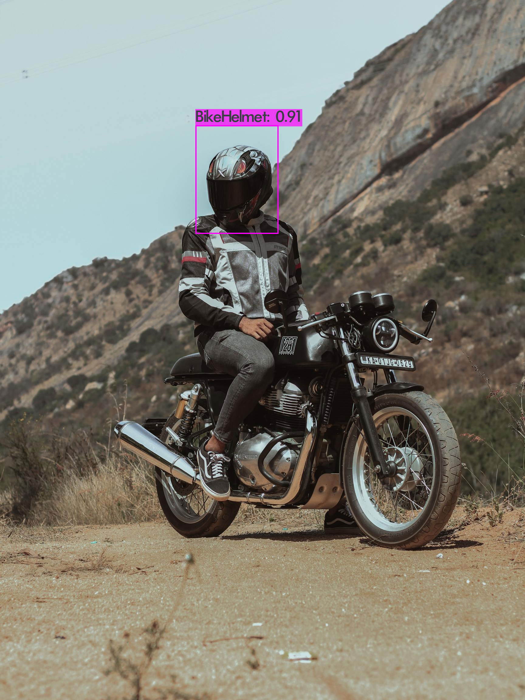
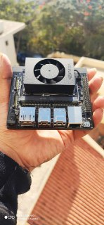

# Helmet Detection App

> Wearing a helmet is the single most effective way of reducing head injuries and fatalities resulting from motorcycle and bicycle crashes. Motorcyclists who do not wear helmets are at a much higher risk of sustaining head injuries and from dying from these injuries - WHO(World Health Organization).



To better the safety of people riding motorcycles and bicycles, here is Helmet Detection App, an AI-powered Computer Vision application that helps in automatic detection of helmets on people riding motorcycles and bicycles.

## Citations

* [AlexeyAB/darknet](https://github.com/AlexeyAB/darknet)
* [aj-ames/Hermes-Deepstream](https://github.com/aj-ames/Hermes-Deepstream)

## Index

1. [Introduction](#Introduction)
2. [Deepstream Setup](#Deepstream-Setup)
    1. [Install System Dependencies](#Install-System-Dependencies)
    2. [Install Deepstream](#Install-Deepstream)
3. [Running the Application](#Running-the-Application)
    1. [Clone the repository](#Cloning-the-repository)
    2. [Run with different input sources](#Run-with-different-input-sources)

## Introduction

Helmet detection Application consists of an Intelligent Video Analytics Pipeline powered by Deepstream and NVIDIA Jetson Xavier NX



This project is a proof-of-concept, trying to show surveillance of roads for the safety of motorcycle and bicycle riders can be done with a surveillance camera and an onboard Jetson platform.

## Deepstream Setup

This post assumes you have a fully functional Jetson device. If not, you can refer the documentation [here](https://docs.nvidia.com/jetson/jetpack/install-jetpack/index.html).

### 1. Install System Dependencies

```sh
sudo apt install \
libssl1.0.0 \
libgstreamer1.0-0 \
gstreamer1.0-tools \
gstreamer1.0-plugins-good \
gstreamer1.0-plugins-bad \
gstreamer1.0-plugins-ugly \
gstreamer1.0-libav \
libgstrtspserver-1.0-0 \
libjansson4=2.11-1
```

### 2. Install Deepstream

Download the DeepStream 5.0.1 Jetson Debian package `deepstream-5.0_5.0.1-1_arm64.deb`, to the Jetson device from [here](https://developer.nvidia.com/assets/Deepstream/5.0/ga/secure/deepstream_sdk_5.0.1_amd64.deb). Then enter the command:

```sh
sudo apt-get install ./deepstream-5.0_5.0.1-1_arm64.deb
```

## Running the Application

### 1. Clone the repository

This is a straightforward step, however, if you are new to git or git-lfs, I recommend glancing threw the steps.

First, install git and git-lfs

```sh
sudo apt install git git-lfs
```

Next, clone the repository

```sh
# Using HTTPS
git clone https://github.com/AdityaVarmaUddaraju/Helmet-Detection.git

#Using SSh
git@github.com:AdityaVarmaUddaraju/Helmet-Detection.git
```

Finally, enable lfs and pull the yolo weights

```sh
git lfs install
git lfs pull
```

### 2. Run with different input sources

The solution can be run on one or many input sources of multiple types, all powered using NVIDIA Deepstream.

First, build the application by running the following command:

```sh
make clean && make
```

This will generate the binary called `helmet-detection-app`. This is a one-time step and you need to do this only when you make source-code changes.

Next, create a file called `inputsources.txt` and paste the path of videos or rtsp url.

```sh
file:///home/user/Videos/input.mp4
<rtsp url>
```

Now, run the application by running the following command:

```sh
./helmet-detection-app
```

Finally, add the url in `inputsources.txt` and start `./helmet-detection-app`.

## Video demonstration of the App

Link to video demonstartion [video_link](https://youtu.be/h5o3DX86gIw)
